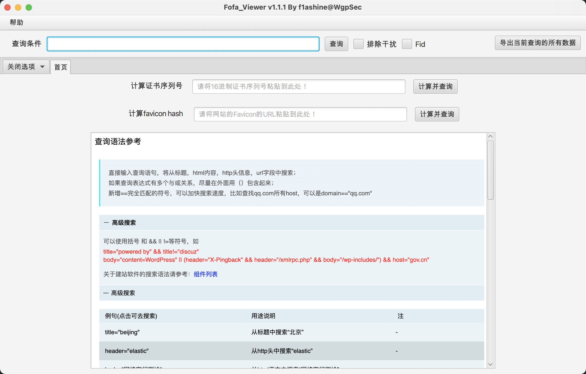
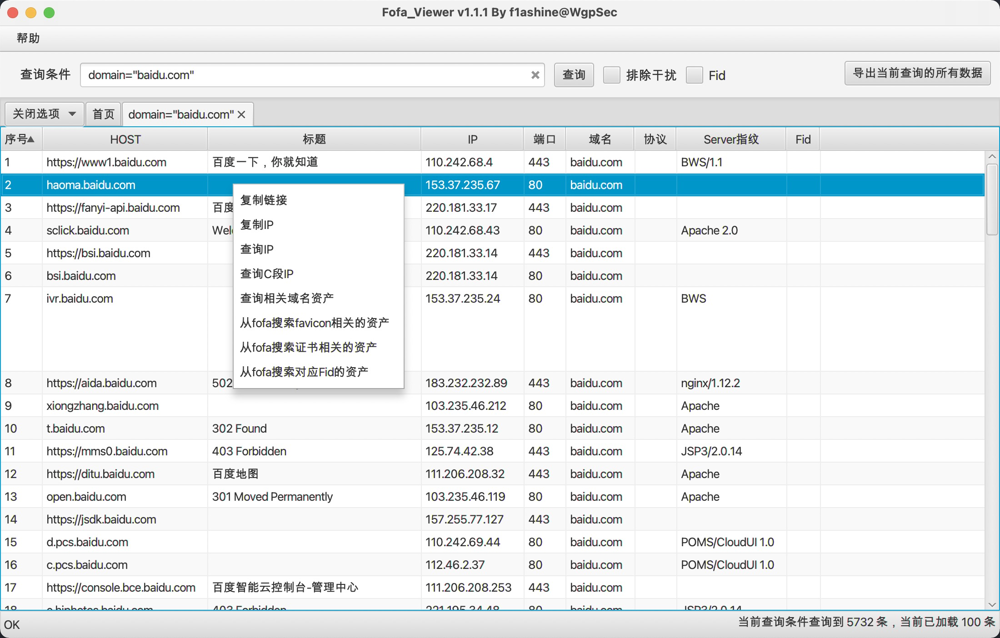
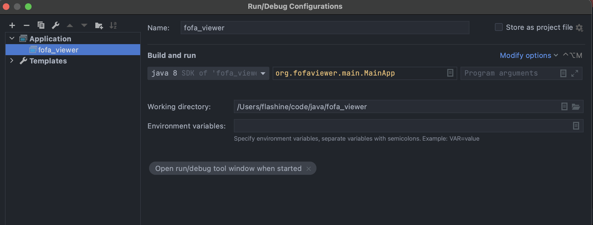

<h1 align="center">Fofa_Viewer 🔗 </h1>
<p align="center"> 


</p>


中文 | [EN](README.en.md)

##  简介

Fofa_Viewer： 一个简单易用的fofa客户端，由 WgpSec狼组安全团队 [**f1ashine**](https://github.com/f1ashine) 师傅主要开发。程序使用 JavaFX 编写，便于跨平台使用

##  使用说明
本工具基于 FoFa 的 API 进行封装，使用时需要高级会员或者普通会员的 API key。使用注册用户的 API key 会提示账户需要充值F币。

点击 https://github.com/wgpsec/fofa_viewer/releases 下载

- 如果你使用的是 JDK11 以及更高的 Java 版本，请选择不带版本号的zip包使用
- 如果你使用的是 **JDK8** 版本，请选择下载 FoFaViewer_JDK8

JDK16+ 在导出 Excel 时会报错，可在命令行添加 JVM 参数 `--illegal-access=permit` 以导出。

下载后修改 `config.properties`即可开始使用，api参数默认为`https://fofa.info`，若fofa官方更换域名可修改该参数后再使用。

Mac 用户可通过 [自动化操作创建应用程序](docs/mac.md) 建立快速启动 Fofa_Viewer 的快捷图标

**若下载速度太慢可以使用**

https://hub.fastgit.org/wgpsec/fofa_viewer (推荐)

https://gitee.com/wgpsec/fofa_viewer （镜像）

**FOFA会员说明链接！！！！！**

VIP说明：https://fofa.info/static_pages/vip

## :sparkles: 功能
1. 多标签式查询结果展示
2. 丰富的右键菜单
3. 支持查询结果导出为excel文件
4. 支持手动修改查询最大条数，方便非高级会员使用(修改`config.properties`中的`maxSize`即可)
5. 支持证书转换 将证书序列填写入启动页框内可转换，再使用 `cert="计算出来的值"` 语法进行查询 [具体例子](https://mp.weixin.qq.com/s/jBf9h6IQVja6WwFcSYEvKg)
6. 支持输入智能提示
7. 支持fofa的一键排除干扰（蜜罐）功能。（注：需要高级会员，使用时会在tab页标记`(*)`）
8. 支持Fid查询（注：需要高级会员，查询时需要勾选）
9. 支持full查询(查询全部数据)
10. 显示fofa官网的查询语法




## Q&A
1. 为什么查询显示结果超过了10000条，但是导出的数据不到10000条？  
    由于fofa api的限制，每个查询条件最多获取10000条数据，所以超过10000条以后的数据将无法导出，可尝试通过关键字`after`和`before`限制查询时间来获取数据。

2. 为什么界面显示和excel导出的数据比查询到的数据要少？  
    由于fofa查询到的http数据中有部分数据重复，为了二次扫描和查看方便，工具做了去重处理，具体分为以下四种情况:
  - 端口为80：去掉协议头显示为http的数据
    
  - 端口为443：
    
  - 非80端口的http
    
  - 非443端口的https
    
    
3. 为什么有的网站明明有favicon但是请求不到？  
    说一下浏览器获取favicon的流程：  
   ① 先去html的header标签中提取`<link rel=icon href=xx>`，然后加载href中的链接  
   ② 如果没有link标签，浏览器会加载根目录的`favicon.ico`，如果响应404就代表网站未提供favicon  
    本工具使用的是`jsoup`对网页进行解析，对于使用Vue一类构建的网站只能通过chrome进行js解析后获取link标签然后获取favicon地址，对于这种情况目前只能将favicon的链接粘贴到首页进行查询。
   
4. IP和端口两个一起排序？  
    先点击IP或者端口这一列的header进行排序，然后按住shift点击另一列就可以一起排序了

## :rocket: 二次开发
```
git clone https://github.com/wgpsec/fofa_viewer.git
```

本项目使用 `maven-assembly-plugin`打包编译，可按照下图进行配置



idea打开项目，等待依赖包下载完毕后直接双击Plugins-assembly-assembly:assembly，然后将target文件夹中带有"with-dependencies"的jar包拷贝到带有config.propertiese的文件夹再运行即可。


## ⚠️ 说明
- 使用前需要在`config.properties`中配置`email`和`key`才能正常使用 **FOFA高级会员**
- 项目中配置了error.log，如果有需要提bug，希望能带上这个截图，另外也欢迎提issue帮助改进。
- 如果出现了bug，不知道哪出错了，也可以在终端使用`java -jar fofaviewer.jar`启动，出错后终端会显示具体的错误详情，提交issue的时候请带上截图。
- 关注公众号回复 “加群” 即可加入官方交流群


[](https://starchart.cc/wgpsec/fofa_viewer)

